<!-- Main -->

<!-- One -->
<section id="one">
	

		<header class="major">
			<h1>My projects</h1>
		</header>

<!-- Content -->
<h2 id="content">Main ones</h2>

	

		<h3>Programme recommendation System</h3>
		
I developed a prototype of programme recommendation System for YouView TV ltd

		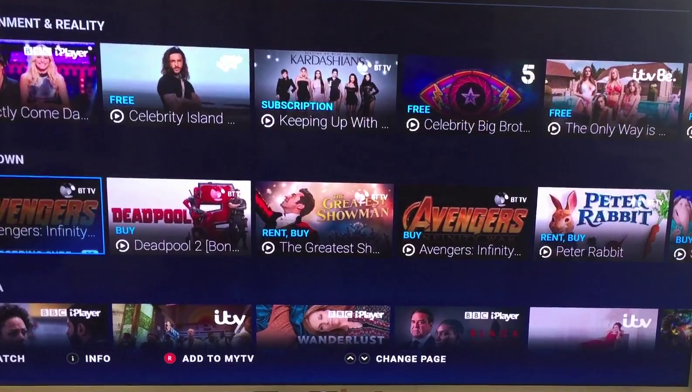
		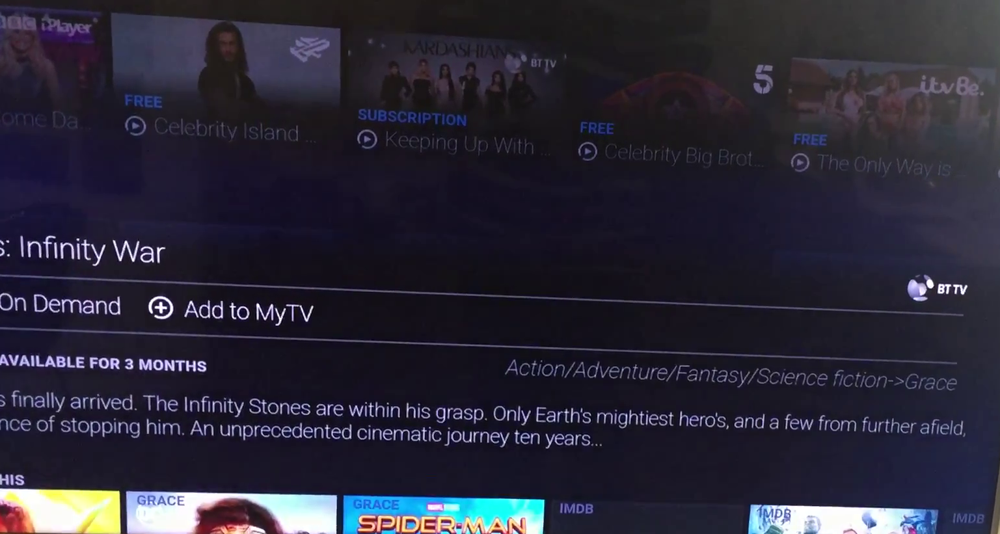
		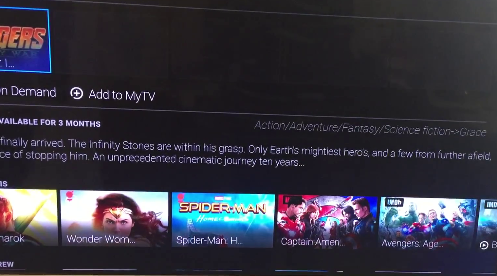
		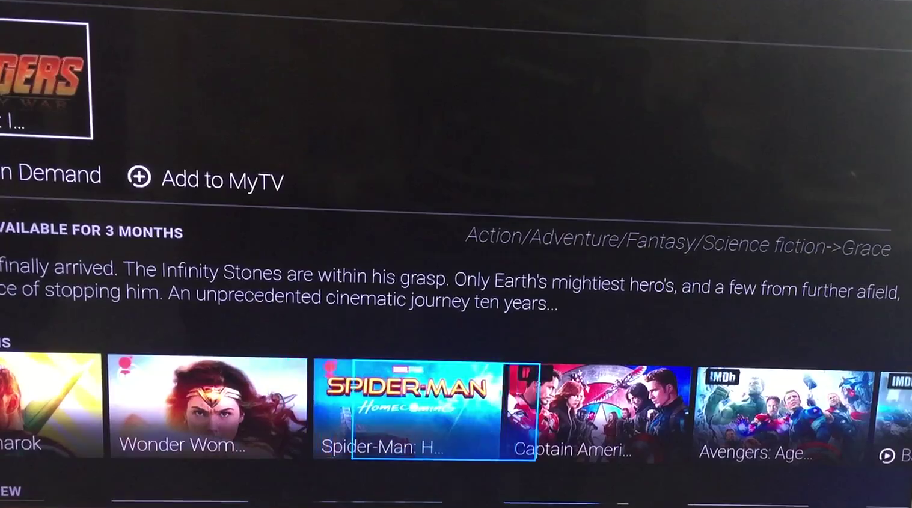
		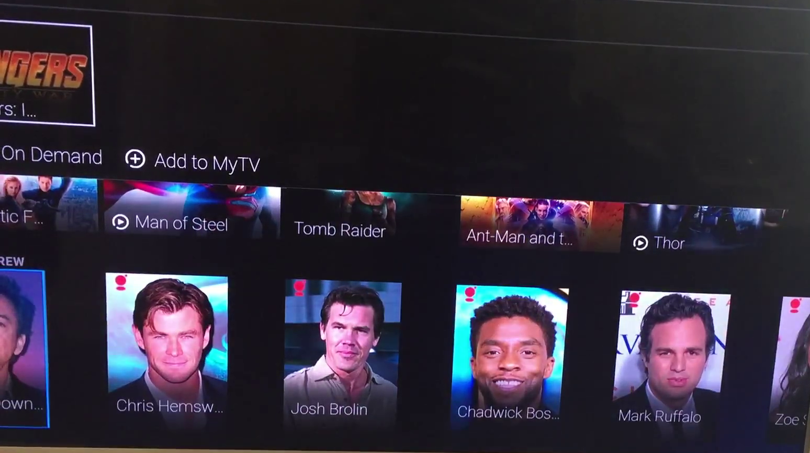
		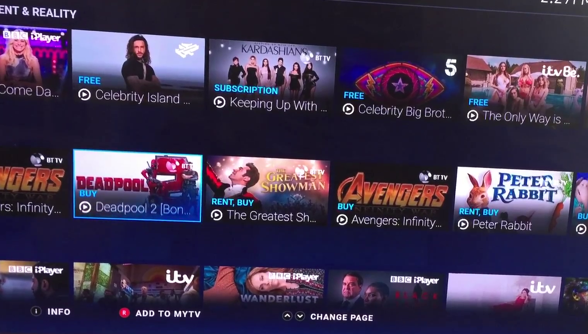
		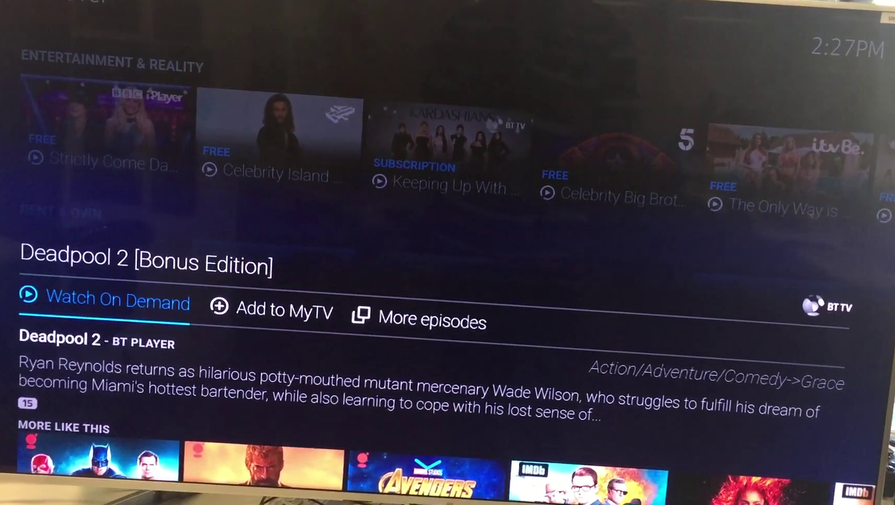
		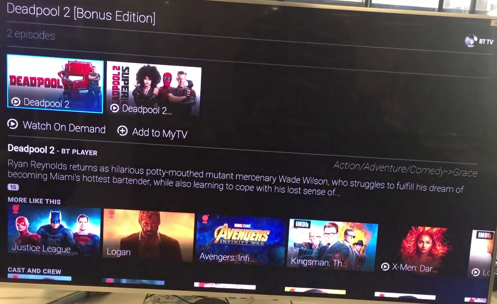
		
		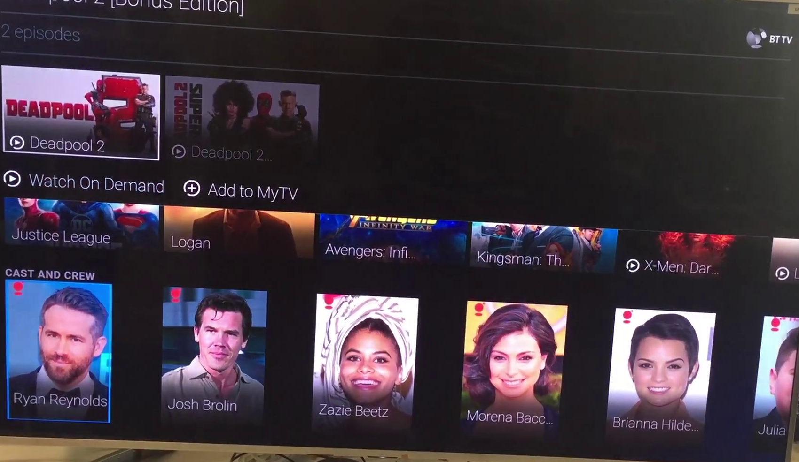
		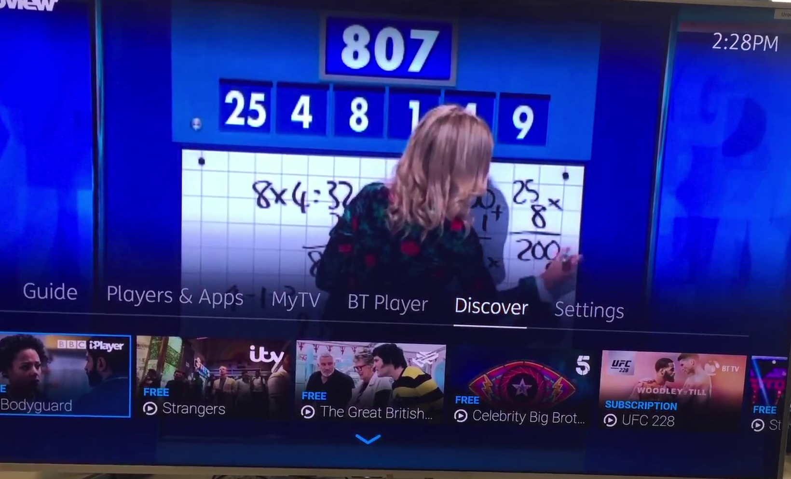
		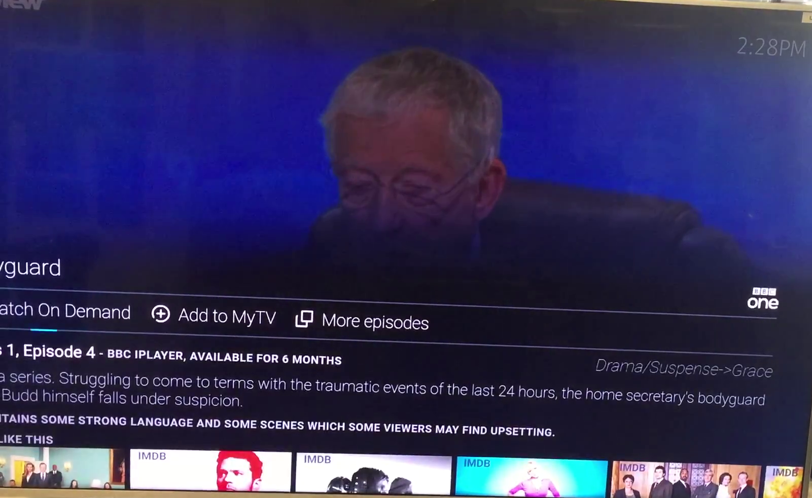
		<button class="w3-button w3-display-left" onclick="plusDivs(-1)">&#10094;</button>
		<button class="w3-button w3-display-right" onclick="plusDivs(+1)">&#10095;</button>
	

	

		<h3>Auction House system</h3>
		

		 <a href="https://github.com/billyjason/Auction-House-System">
		https://github.com/billyjason/Auction-House-System</a>
		

	

	<!-- Break -->
	

		<h3>Cache Similator</h3>
		

		 <a href="https://github.com/billyjason/Cache-Similator-LRU-FIFO-and-Random-">
		https://github.com/billyjason/Cache-Similator-LRU-FIFO-and-Random-</a>
		

	

	

		<h3>Natural language processing pipeline</h3>
		

		 <a href="https://github.com/billyjason/Natural-Language-Processing-Pipeline">
		https://github.com/billyjason/Natural-Language-Processing-Pipeline</a>
		

	

	

		<h3>Micro Hasketll Formal Language Processing Pipeline</h3>
		

		 <a href="https://github.com/billyjason/Micro-Hasketll-FL-Pipeline">
		https://github.com/billyjason/Micro-Hasketll-FL-Pipeline</a>
		

	

	

		<h3>Library Managment System</h3>
		

		 <a href="https://github.com/billyjason/Library-Managment-System">
		https://github.com/billyjason/Library-Managment-System</a>
		

	

	

		<h3>Voting Site</h3>
		

		 <a href="https://github.com/billyjason/votingsite2">
		https://github.com/billyjason/votingsite2</a>
		

	

		<h3>This video hightlights the projects I worked on when I was in highschool (2013-2016)</h3>
		<iframe width="560" height="315" src="https://www.youtube-nocookie.com/embed/v8cuZL6tEbk?start=1" frameborder="0" allow="accelerometer; autoplay; encrypted-media; gyroscope; picture-in-picture" allowfullscreen></iframe>
	

